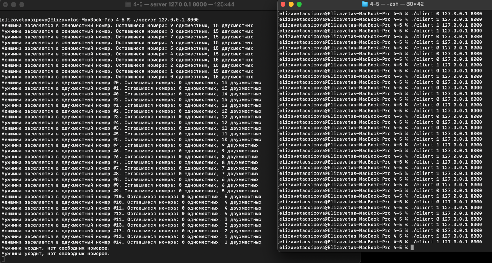
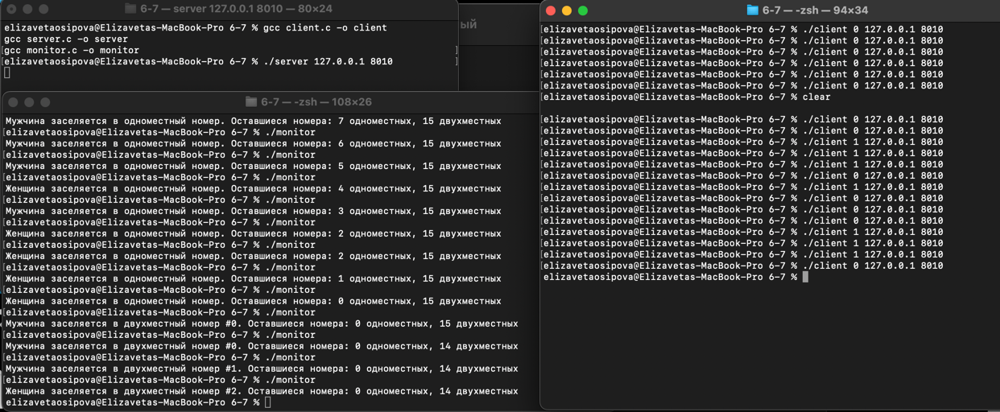

## Домашнее задание №3.

Сетевые взаимодействия с применением транспортного протокола TCP

### **Осипова Елизавета Владимировна - БПИ-219**.

### **Вариант №14. <br>**

#### Задача о гостинице – 3 (дамы и джентльмены).

В гостинице 10 номеров рассчитаны на одного человека и 15 номеров рассчитаны на двух человек. В гостиницу случайно
приходят клиенты–дамы и клиенты–джентльмены, и конечно они могут провести ночь в номере только с представителем своего
пола. Если для клиента не находится подходящего номера, он уходит искать ночлег в другое место. Клиенты порождаются
динамически и уничтожаются при освобождении номера или уходе из гостиницы при невозможности поселиться. Создать
приложение, моделирующее работу гостиницы. Каждого клиента реализовать в виде отдельного процесса.

## 4-5 баллов

Описание решения на 4-5 баллов:


Этот проект включает в себя две основные части: сервер и клиент.

Серверная часть представляет собой симуляцию отеля с одноместными и двухместными номерами. Для каждого двухместного номера сохраняется количество заселенных людей и их пол. Когда клиент подключается к серверу, он передает информацию о поле посетителя, а сервер заселяет посетителя в соответствующий номер и обновляет информацию об отеле.

В серверной части создается Unix-сокет, к которому могут подключаться клиенты. После подключения клиента информация, передаваемая им (в данном случае пол посетителя), считывается и обрабатывается. В зависимости от переданной информации, клиент заселяется в одноместный или двухместный номер, и обновляется информация об отеле. Если нет свободных номеров, клиенту отказывают в заселении.

Клиентская часть подключается к серверу через Unix-сокет и передает информацию о поле посетителя. Затем она завершает работу.

При запуске клиентского приложения передается аргумент, определяющий пол посетителя (0 или 1). Это значение передается серверу при подключении.

Оба эти приложения написаны на языке C и используют Unix-сокеты для межпроцессного общения.


Для компиляции используйте gcc:
```
gcc server.c -o server
gcc client.c -o client
```

Запустите сервер:

```./server```

Запустите клиентскую программу, указывая пол посетителя (0 или 1):

```
./client 1
./client 0
```

Запустите столько клиентов, сколько хотите заселить в отель. Каждый клиент подключается к серверу, получает номер (если доступен) и завершает работу. Сервер продолжает работать, пока не будет остановлен.



## 6-7 баллов

Компонент 1: Клиентская программа
Программа вначале принимает три аргумента командной строки: пол клиента (предполагается, что 1 означает мужчину, а 0 - женщину), IP-адрес и порт. Эти аргументы передаются функции request_room. Эта функция создает сокет TCP и подключается к указанному серверу. Она затем отправляет на сервер информацию о поле клиента. После отправки запроса соединение закрывается.

Компонент 2: Статус программы отеля
Эта программа просто открывает файл с именем hotel_status.txt и выводит его содержимое на консоль. Это файл, в который записывается информация о текущем состоянии отеля.

Компонент 3: Серверная программа отеля
Это серверное приложение, которое отслеживает статус отеля. Отель имеет 10 одноместных номеров и 15 двухместных номеров. При запуске сервера инициализируется статус отеля: все номера пусты, и каждый двухместный номер может быть занят людьми одного пола.

Сервер начинает прослушивание на указанном IP-адресе и порту, и при каждом подключении клиента вызывает функцию handle_client. Эта функция считывает запрос клиента, преобразует его в целое число (пол), а затем пытается разместить клиента в номере отеля. Правила размещения таковы:

1) Если есть свободные одноместные номера, клиент занимает одноместный номер, независимо от пола.
2) Если одноместные номера заняты, клиент пытается занять двухместный номер. Клиент может занять двухместный номер, если он пуст или уже занят клиентом того же пола.
3) Если невозможно найти подходящий номер, клиент уходит.
Каждый раз, когда клиент пытается заселиться в номер, статус отеля обновляется и записывается в файл hotel_status.txt.

В целом, эти программы симулируют простую систему управления отелем, где клиенты разных полов могут занимать одноместные и двухместные номера согласно определенным правилам.


